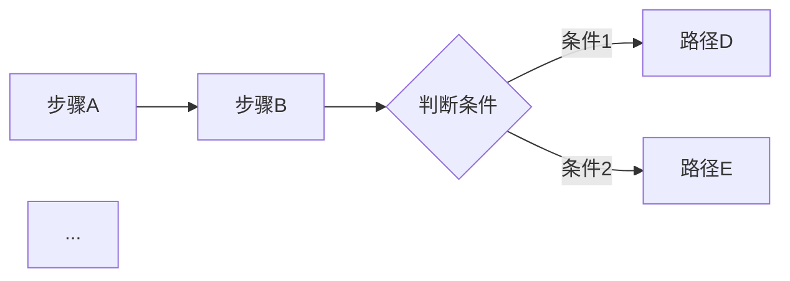

# 简历修改 Skill 提炼

> 来源：`参考项目甲`（参考项目甲-tailor + 参考项目甲）+ `参考项目乙`（pdf + cover + apply + auto-pipeline）
> 用法：你在每条下面直接修改、删除、补充内容，改完后交回给我，我会转成 resume-tailor 的 skill。

---

## 一、简历预处理

### 1.1 简历文本清洗（来自 参考项目甲 Step 2）

**触发条件**：用户从 PDF/Word 粘贴简历时，自动检测格式是否正常

**判断标准**（四项全部满足 = 格式OK，跳过清洗）：
- 有 ≥2 处章节标记（`#`、`##` 或有序列表）
- 有 ≥2 处列表标记（`-`、`*` 开头）
- 平均非空行长度 ≥15 字符
- 不存在连续 5 行以上每行只有 1-3 字符的情况

**清洗操作**（只动格式，不动文字）：
- 合并被换行打断的同句（如 `负责抖音\n小视频` → `负责抖音小视频`）
- 合并被拆散的标题/姓名（如 `张\n三` → `张三`）
- 移除连续空行（≥3 个空行 → 保留 1 个）
- 还原项目符号（`·` `●` `▪` → `- `）
- 识别常见章节关键词（个人信息、工作经历、项目经历等），补 `## ` 标题
- 规范缩进（tab → 2 空格）
- 删除零宽字符

**禁止操作**：
- 不增删改任何文字
- 不修正错别字
- 不翻译、总结、精简、扩写
- 不推断补齐缺失信息

**回滚机制**：清洗前保存原始版 `resume.raw.md`，用户随时可说「还原原版」切回

---

### 1.2 简历 STAR 拆解（来自 参考项目甲-analyzer Step 1）

**目的**：将简历中每段工作/项目经历拆解成 S/T/A/R 四要素，供后续匹配打分和定制使用

**过滤规则**（先过滤再拆解）：
- 整体跳过：个人信息、专业技能、教育背景、自我评价、证书奖项等区块
- 行级跳过：没有行动动词 + 没有结果描述的行（如纯公司名/日期/部门名）
- 注意：「运营组」「品牌部」这类部门名中的词不算行动动词

**拆解格式**：
```
## [公司/项目名] · [职位/角色] · [时间段]
- S (Situation): 业务背景、团队状况、面临的挑战
- T (Task): 被赋予的具体目标/职责
- A (Action): 具体做了什么（方法/流程/协作方式）
- R (Result): 可量化成果（数字/百分比）；无数字标注 ⚠️ 缺数字
技能关键词：[从该段提取的技能词列表]
```

**缓存机制**：简历没变（hash 一致）就复用，不重新拆解

---

### 1.3 简历质量评估（来自 参考项目甲 Step 2.5）

**目的**：在定制前先诊断简历本身的问题，让用户知道哪里薄弱

**评估维度**（STAR 三维度打分，每项：✅合格 / ⚠️薄弱 / ❌缺失）：

| 维度 | ✅ 合格 | ⚠️ 薄弱 | ❌ 缺失 |
|------|---------|----------|---------|
| 场景/问题 (S/P) | 有明确业务背景或要解决的问题 | 背景模糊，一笔带过 | 无任何场景描述 |
| 行动 (A) | 具体描述「我做了什么」，有方法/手段 | 只写职责，没有行动细节 | 缺失 |
| 结果 (R) | 有量化数字或明确业务价值 | 结果模糊（如"效果不错"） | 无结果描述 |

**额外检查**：
- 是否大量使用「负责」「参与」「协助」等被动词
- 是否有明显可量化但留白的指标

**空壳经历警示**：如果某段工作经历只有公司名+时间，没写任何工作内容和成果 → 在评估报告最顶部显著提醒用户，因为这是简历最致命的短板

**专业技能板块诊断**（独立于 STAR 评估）：
- 虚浮词/空泛声称（如「精通所有前端技术」）
- 缺工具名/过于宽泛（如「熟悉数据分析」没写具体用什么工具）
- 无程度分层（全部条目都是同一个程度词）

---

## 二、JD-简历匹配分析

### 2.1 四维匹配度打分（来自 参考项目甲-analyzer Step 2）

**维度 1 — 硬技能匹配**：
- JD 要求的技能中，简历命中率 × 100 = 基础分
- JD 标注「加分项」的技能命中，每项 +5（上限 100）
- 输出：✅命中 / ⚠️缺失 / 🎯已有但未突出

**维度 2 — 经验深度**：
- 对比 JD 要求年限 vs 简历实际年限（±1 年 → 90-100；少 2 年 → 50-65）
- 同时考察项目复杂度

**维度 3 — 行业/领域契合**：
- 同行业同场景 → 90-100；行业相近 → 75-90；可迁移 → 60-75

**维度 4 — 软性匹配**：
- JD 强调的软技能（沟通能力、0-1 经验、跨团队协作等）在简历中是否有具体事例支撑
- 每项有支撑 +15（上限 100）

**总分** = 四维平均分（四舍五入）

---

### 2.2 JD 关键词提取（来自 参考项目乙 cover Step 4 + pdf Step 3）

**提取 8-20 个 JD 中的关键词/短语**，分两组：

**ATS 关键词**（机器筛选会用到的精确术语）：角色名、工具名、方法论名称

**人类阅读信号**（显示你真的读了 JD 的语言线索）：JD 使用的动作动词、产品/领域名词、成果描述方式、团队协作的措辞

**应用规则**：
- 只镜像词汇，不镜像句式结构
- 内容始终来自简历，只换措辞
- 自然地融入，融不进去的就不硬塞
- 每个关键词只用一次，不重复堆密度

---

## 三、简历定制（核心）

### 3.1 伦理红线（来自 参考项目甲-tailor 边界 A + 参考项目乙）

**绝不触碰的底线**：
- 不凭空增加简历没有的项目、技能、公司经历
- 不编造具体数字（用户量/增长率/营收等），缺数据用 `[请填写：xxx]` 占位
- 不修改工作时间段、职级、公司名称
- 不为空壳条目（只有标题/时间，无行动/结果描述）编造任何内容
- 不跨章节搬运内容（如把项目经历的数据写到工作经历里）
- 不声称用户是某项目/工具/库的作者，除非简历明确写了

**可以做（绿区）**：
- 改写措辞、调整语句顺序
- 合并/拆分句子
- 把相关经历移到醒目位置
- 用 STAR 重写已有描述
- 对「显然蕴含」但未明说的信息轻度补充（加 `[需用户确认]` 标注）
- 用 JD 的关键词重新表述已有经验（不改变事实含义）

**🆕 引导式深挖（绿区的主动延伸）**：
- 当用户经历描述过于简略时，**主动提问引导用户**从规模感、难点、协作、前后对比、工具方法、复用影响、决策权等角度重新审视自己的经历
- 用户回答出的新信息，经用户确认后写入简历和架构图，视为用户提供的事实
- 帮用户用更专业的措辞改写口语化描述、将零散信息组织成清晰流程、识别用户自己没有意识到的亮点
- ⛔ 底线不变：用户说"大概几十个客户"→ 不能写成"100+"；用户没提用过某工具 → 不能自行添加；用户说"想不出来了"→ 到此为止

---

### 3.2 差异化定制 — 三项强制下限（来自 参考项目甲-tailor §核心任务）

**每个 JD 都必须做到这三点**（只改内容不改架子）：

1. **经历/项目排序**：把与当前 JD 最相关的经历/项目移到所在章节最前面
2. **项目内成果排序**：每个有实质内容的项目，把贴合 JD 的成果/指标移到最前面
3. **技能板块排序 + 措辞**：把 JD 强调的技能/工具移到技能板块最前；引子句和成果句的措辞向 JD 的关键词靠拢

**重要约束**：
- 每个 JD 必须基于它自己的 analysis 独立推导，禁止复用上一个 JD 的定制结果
- 即使两个 JD 很像，也要重新走一遍三项下限
- 如果简历确实无可调整（如仅 1 个项目且 JD 高度雷同），允许不动，但必须在 changelog 里如实说明原因，绝不编造改动

---

### 3.3 结构冻结规则（来自 参考项目甲-tailor 边界 B）

**章节层面**：
- 章节标题逐字保留，不改字、不拆分、不合并
- 顶层章节排列顺序冻结，按原简历顺序
- 不增删任何段落（个人信息、联系方式、自我评价等元数据章节整体保留）
- 不跨章节搬运内容

**条目层面**：
- 每段经历内的子条目数不删减（弱化项只缩短措辞，不删条目）
- 空壳条目原样保留
- 列表格式逐字保留（原简历用 `-` 就还用 `-`，原简历用 `*` 就还用 `*`）
- 绝对禁止把多条列表项压成一段普通文字

**技能板块专属约束**：
- 程度词保留（「熟练掌握」「熟悉」「了解」不删除）
- 工具名/平台名/技术名不删减，只调整排列顺序
- 合并极严约束：仅「同一具体工具/能力的不同表述」可合并；不同维度的能力绝不合并；合并后条目数 ≥ 原条目数的 80%

---

### 3.4 内部推理 — STAR 对齐分析（来自 参考项目甲-tailor Step 1.0）

**对照 JD 逐段推理以下维度**（内部推理，不写文件）：

- **经历排序**：同一章节内，哪条与 JD 最相关、应前移
- **技能排序**：对照 JD，把相关技能/工具前移
- **Action 补充**：哪段经历的行动描述缺少 JD 强调的工作方式（如「跨团队协作」「数据驱动决策」），可在已有事实上补充
- **Result 缺口**：哪段经历缺量化指标，需插入 `[请填写：xxx]` 占位
- **隐含信息**：哪段经历「显然蕴含」某 JD 关注点但未明说，可轻度补充（加 `[需用户确认]`）
- **弱化项**：哪段经历与 JD 相关性低，应后移或精简措辞
- **项目内成果重排**：每个有料项目的成果行按 JD 相关性重新排列

---

### 3.5 产出物：定制三件套（来自 参考项目甲-tailor Step 1.1-1.3）

#### (A) 定制简历 `resume.md`

基于 STAR 对齐分析结论改写，全程遵守伦理红线和结构冻结规则：
1. 同章节内调整条目顺序
2. 重写各段 Action / Result，保持事实不变
3. 技能板块重排措辞
4. 缺量化数据处插 `[请填写：<描述>]`；轻度补充处加 `[需用户确认]`

**自检关卡**（写入前必须执行）：逐项确认三项强制下限是否落实，若整份简历与原简历逐字相同 → 回头重做（除非触发「可以不改」的例外）

#### (B) HR 开场白 `opener.md`

200 字以内，结构：
1. 开头固定「您好！」
2. 自我介绍 1 句（自然中文，禁用「我是…的求职者」「本人具备…」等套话）
3. 点出 1 个与 JD 最相关的具体经历（必须是简历真实存在的）
4. 表达意愿 1 句

规则：只提简历中有的经历；有 `[请填写]` 占位的不引用其数字；有 `[需用户确认]` 的保留提示

#### (C) 改动清单 `changelog.md`

逐条记录所有改动，每条注明原因（给用户的透明度报告）：

**必须基于真实 diff，不准凭记忆写**：
- ✏️ 措辞调整：原文 → 改后，注明 JD 哪里触发了改动
- 🔼 顺序调整：哪个段落移到哪个位置，注明原因
- ⚠️ 需用户回填：哪些位置插了 `[请填写]`
- 🔵 需用户确认：哪些位置加了 `[需用户确认]`
- ❌ 弱化/后移：哪些段落被精简或后移
- 🔧 技能板块改动：顺序调整 / 措辞改写 / 条目合并
- 💡 技能板块优化建议（需用户手动完善，AI 未自动修改的）

**核心规则**：只写实际发生的改动，没发生的节一律不写（不输出空节标题）；如果简历完全没有改动，只写一节「本岗位未改动正文」说明原因 + 一节补充建议

#### 三件套最终版示例

##### (B) 开场白 `opener.md` 终版格式

```markdown
# 开场白 · <公司名> · <岗位名>

您好！我有 X 年 <领域> 经验，主要负责 <核心方向>。<点出 1 个与 JD 最相关的具体经历，说清做了什么+成果>。看到这个岗位非常感兴趣，希望有机会进一步了解。
```

**约束**：
- 严格 ≤200 字（汉字/标点各计 1 字，英文按空格分词每词计 1 字，阿拉伯数字串计 1 字）
- 禁用句式：「我是…的求职者」「本人具备…」「可投岗」「贵司」等生硬套话
- 只引用简历中真实存在且无 `[请填写]` 占位的经历
- 若引用的经历含 `[需用户确认]` 标注，保留提示让用户核对

**正确示例**（仅供参考，内容需替换为用户实际经历）：
> 您好！我有 3 年新媒体运营经验，主要负责小红书和抖音账号的内容策划与增长。在上一份工作中主导了品牌冷启动项目，6 个月内将账号粉丝从 0 做到 20 万，爆款率稳定在 15% 以上。看到贵公司这个岗位非常感兴趣，期待有机会进一步沟通！

##### (C) 改动清单 `changelog.md` 终版格式

```markdown
# 改动列表 · 对比主简历

## ✏️ 措辞调整
1. [段落名称]：「<原文关键片段>」→「<改后片段>」
   - 原因：<JD 中具体哪里触发了这个改动>

## 🔼 顺序调整
1. 将「<段落摘要>」上移至「<新位置>」
   - 原因：<JD 最关注这个方向>

## ⚠️ 需用户回填
1. [段落名称] Result 段：`[请填写：<具体描述>]`
   - 原因：<简历此处缺数字，JD 强调数据驱动>

## 🔵 需用户确认
1. [段落名称]：「<改写内容>」[需用户确认]
   - 原因：<推断依据>

## ❌ 弱化/后移
1. 将「<段落摘要>」后移/精简
   - 原因：<与 JD 相关性低>

## 🔧 技能板块改动
1. 顺序调整：将「<条目摘要>」上移至最前 — 原因：JD 强调该技能
2. 措辞改写：「<原文>」→「<改后>」— 原因：<说明>
3. 条目合并：「<条目A摘要>」+「<条目B摘要>」→「<合并后>」— 原因：语义重叠

## 💡 技能板块优化建议（需你手动完善，AI 未自动修改）
- **补充工具名**：「<原条目>」→ 建议补充为「<改写示范>」，对照 JD「<JD 原文关键词>」
- **重新分级**：当前全为「<程度词>」，建议区分熟练/熟悉/了解，JD 重点技能：<列出>
- **可后移的条目**：「<条目摘要>」— JD 无相关提及，与岗位相关性低
```

**核心规则**：
- ⛔ 生成前必须先逐行 diff 对比原简历，只记录真实存在的字面差异，不准凭记忆写
- ⛔ 上方各节仅在该类改动实际存在时才输出，空节标题一律不写
- ⛔ 若简历完全没有改动（触发「可以不改」例外），只输出：
  ```
  # 改动列表 · 对比主简历
  ## ℹ️ 本岗位未改动正文
  <原因，如「简历仅 1 个有料项目，本 JD 与已处理岗位要求高度一致，无差异化空间」>
  ## 💡 建议补充（需你手动完善）
  <针对本 JD 的具体缺口提示>
  ```

##### (D) Cover Letter `cover-letter.md` 终版格式（新增，来自 参考项目乙）

```text
[候选人姓名]
[城市] | [邮箱] | [电话] | [LinkedIn]
[学历/证书一行，如有]

Cover Letter: [岗位名]
[公司名], [城市]   [日期 YYYY-MM-DD]

────────────────────────────────────────────────

[称呼 — 可选，知道 hiring manager 名字则写 "Dear Jane Smith,"，不知道则省略]

[开头 — 2 句]
为什么申请 + 职能概述。来自用户回答的「为什么是这个角色/公司」。

[个人简介 — 1 段]
几年经验、当前/最近岗位、领域。来自 cv.md Summary，适配 JD 领域。

[关键成果 — 4-5 条 bullet]
• **Bold 引导短语，** 一句有数字支撑的影响力描述。
• **Bold 引导短语，** 一句有数字支撑的影响力描述。
• **Bold 引导短语，** 一句有数字支撑的影响力描述。
• **Bold 引导短语，** 一句有数字支撑的影响力描述。

[我能解决的问题 — 2-3 句]
来自用户确认的公司调研 + 「你能帮他们解决什么」+ 「你打算怎么做」。
针对这家公司的实际情况，不是泛泛而谈。

[结尾 — 1-2 句]
可入职时间 + 用户选择纳入的 gap 说明（如有）。

[外语结尾 — 如适用]
仅当用户在 gap 环节确认要写。用该语言写。PDF 中斜体。
```

**硬约束**：
- 350-420 词（不含 header/credentials）
- 只用主动语态；禁用 em dash
- 禁用 buzzword（leverage、synergy、holistic、passionate、excited、spearheaded 等）
- 禁用填充式开头（「I am pleased to」「I am writing to express」）
- 每个声明必须有数字/系统名/具体成果
- 聊天中起草全文 → 用户明确批准后才生成 PDF

---

### 3.6 关键词注入策略（来自 参考项目乙 pdf Step 12-13）

**合法的重新表述示例**：
- JD 写「RAG 管线」、简历写「LLM 工作流+检索」→ 改为「RAG 管线设计与 LLM 编排工作流」
- JD 写「MLOps」、简历写「可观测性、评估、错误处理」→ 改为「MLOps 与可观测性：评估、错误处理、成本监控」
- JD 写「干系人管理」、简历写「与团队协作」→ 改为「跨工程、运营、业务的干系人管理」

**绝不添加用户不具备的技能，只把真实经验用 JD 的词汇重新表述**

**关键词分布策略**：
- Summary 段：密度最高（前 5 个关键词）
- 每个角色的第一条 bullet：放 1-2 个关键词
- 技能板块：集中展现

---

### 3.7 六秒 recruiter 扫描门（来自 参考项目乙 pdf Step 13）

简历上半部分（第一屏）必须在 6 秒内让 recruiter 看清三件事：
- 目标角色是什么
- 最匹配 JD 的 1-2 个证明点
- 专业可信度

如果第一屏看不到这些信息 → 排序和措辞需要再调整

---

## 四、辅助产出物

### 4.1 Cover Letter 生成（来自 参考项目乙 cover）

**流程**：
1. 解析 JD（角色名、公司名、top 3-4 能力要求、公司使命语言、领域）
2. 公司调研（web search × 3：产品策略 / 挑战问题 / 最新动态）
3. 提取 8-10 个 JD 关键词（分 ATS 关键词 + 人类阅读信号）
4. 检测 gap（领域不匹配/标题差异/语言要求/入职时间）并向用户确认处理方式
5. 四问必答（缺一不可）：
   - A. 为什么是这个角色/公司？
   - B. 你能帮他们解决什么问题？
   - C. 你打算怎么做？（day one 的开场动作）
   - D. 语气？（正式/直接/对话式/镜像 JD）
6. 从 cv.md 选 4-5 条最相关的成果 bullet
7. 在聊天中起草全文，等用户确认后才生成 PDF

**语言规则**：
- 只用主动语态
- 不用缩略语（除非 JD 先用了）
- 不用 em dash
- 禁用 buzzword（leverage、synergy、holistic、passionate、excited 等）
- 禁用填充式开头（「I am pleased to」「I am writing to express」）
- 每个声明都要有数字、系统名或具体成果
- 350-420 词

---

### 4.2 ATS 优化 PDF 生成（来自 参考项目乙 pdf）

**布局规则**：
- 单栏（无侧边栏、无平行列）
- 标准标题（Professional Summary / Work Experience / Education / Skills）
- 无图片/ SVG 中的文字
- 无关键信息放在页眉页脚
- UTF-8、可选中的文字（非光栅化）
- 无嵌套表格
- 不用隐藏文字/白字/关键词堆砌

**Section 顺序**（按 6 秒扫描优化）：
1. Header（姓名、渐变线、联系方式）
2. Professional Summary（3-4 行，关键词密集）
3. Core Competencies（6-8 个关键词标签）
4. Work Experience（按 JD 相关性重排 bullet）
5. Projects（top 3-4 最相关）
6. Education & Certifications
7. Skills

**纸张格式**：美国/加拿大 → letter；其他地区 → A4

---

### 4.3 求职申请表实时辅助（来自 参考项目乙 apply）

**工作流**：
1. 读取浏览器中正在填的申请表
2. 匹配已有的 evaluation report
3. 验证岗位仍活跃 + 公司/职位匹配
4. 预扫描 knockout 问题（经验年限、学历、工签、薪资底线），发现不匹配立即警告
5. 逐题生成个性化回答（从 report + cv.md 推导）
6. 展示格式化回答供复制粘贴
7. 提交后持久化回答到 report

**硬约束**：
- 法律、人口统计、工签、薪资、残疾、退伍军人等敏感字段绝不替填
- 绝不替用户点 Submit

---

## 五、通用原则

### 5.1 事实溯源边界（来自 参考项目乙 + 参考项目甲）

**所有面向用户的产出内容（简历、cover letter、开场白、申请表回答）只能从以下来源生成**：
- 用户的 cv.md / resume.md
- 用户的 profile 配置
- 用户在当前对话中明确说的内容

**绝不从以下来源提取内容事实**：
- 跨会话的 memory 文件
- 同机器上其他项目的信息
- 对用户工作的上下文推断（除非用户明确确认过）

---

### 5.2 质量优先，非数量优先（来自 参考项目乙 伦理）

- 目标是为用户找到真正匹配的岗位，不是海投
- 匹配度低于阈值的岗位，明确建议不投
- 每份申请都经过人工审核再提交，绝不自动投递

---

### 5.3 持续学习（来自 参考项目乙）

- 用户纠正打分 → 更新对用户的理解
- 用户说「这个分太高/太低」→ 记住偏好
- 每次评估后系统应该更聪明

---

## 六、两个项目差异对照表

> 👇 以下是你需要逐条做决策的差异点。请直接在「你的决定」列写意见（保留/删除/合并/修改），我会按此执行。

| # | 差异点 | 参考项目甲 做法 | 参考项目乙 做法 | 你的决定          |
|---|--------|--------------|-----------------|---------------|
| 1 | **定制产出物** | 三件套：定制简历 `resume.md` + HR 开场白 `opener.md` + 改动清单 `changelog.md` | 简历 PDF + Cover Letter PDF（无独立的 changelog） | 融合            |
| 2 | **匹配评分体系** | 4 维 0-100 分（硬技能/经验深度/行业契合/软性匹配），机械规则为主 | A-G 7 块评估 + 1-5 分综合制（CV匹配/North Star/薪酬/文化/红线），全程 LLM | 融合            |
| 3 | **简历最终格式** | 纯 Markdown，用户自己转 PDF | HTML 填模板 → Playwright 渲染 → 输出 ATS 优化的 PDF | 融合            |
| 4 | **STAR 拆解** | 自动拆解每段经历为 S/T/A/R + 技能关键词，简历不变就缓存复用 | 融入 evaluation report 的 Block F（STAR+R 故事，多了 Reflection 反思栏） | 参考项目甲 做法   |
| 5 | **JD 关键词处理** | 无明确规定数量，按维度分析时自然提取 | 15-20 个，分两组：ATS 机器关键词（精确术语）+ 人类阅读信号（动词/领域名词） | 参考项目乙 做法 |
| 6 | **改动透明度** | `changelog.md` 逐条对比原简历 vs 定制版，分类标注（措辞/顺序/需回填/需确认/弱化），空节不写 | 无独立 changelog；Block E（定制计划）给出修改建议表但不逐条 diff | 参考项目甲 做法   |
| 7 | **开场白/Outreach** | HR 私信 `opener.md`，≤200 字，中文，结构固定（您好+自介+点经历+表意愿） | LinkedIn outreach（`contacto` 模式），不限字数，根据联系人类型（recruiter/hiring manager/peer）调整策略 | 参考项目甲 做法   |
| 8 | **Cover Letter** | 无独立 Cover Letter | 有（`cover` 模式）：四问必答 → 聊天起草 → 用户确认 → 生成 PDF，350-420 词 | 参考项目乙 做法 |
| 9 | **申请表实时辅助** | 无 | 有（`apply` 模式）：读浏览器表单 → 匹配 report → 预扫描 knockout 问题 → 逐题生成回答 → 绝不替点 Submit | 删除            |
| 10 | **简历结构约束** | 极严格冻结规则：章节标题逐字保留、顶层章节顺序冻结、不增删段落、子条目数不删减、列表标记保留、技能程度词保留、跨章节搬运禁止 | 较灵活：允许重新组织 section 顺序（通过 `--allow-reorder` 放行），HTML 模板骨架固定但 AI 可以调整内容布局 | 融合            |
| 11 | **岗位真实性检测** | 无 | Block G 幽灵岗位检测：发布新鲜度/JD质量/公司裁员信号/重复发布/雇佣分类风险 | 参考项目乙 做法 |
| 12 | **薪酬分析** | 无 | Block D：市场薪资调研 + JD 报价记录 + 公司薪酬声誉 | 参考项目乙 做法 |
| 13 | **面试准备** | 无 | Block F：6-10 个 STAR+R 故事 + 案例研究 + 红线问题预答 | 参考项目乙 做法 |
| 14 | **评分缓存** | 有（analysis.md 缓存，JD 和简历 hash 都不变就复用） | 无（每次评估重新跑全流程） | 参考项目甲 做法   |
| 15 | **语言** | 中文为主 | 多语言（英/德/法/日/阿/土/印/中等），根据 JD 语言自动切换 | 中文            |
| 16 | **简历文本清洗** | 有（Step 2）：检测格式 → 清洗断行/缩进/项目符号 → 提供回滚 | 无（要求用户直接提供 `cv.md`），但 onboarding 流程里有从 LinkedIn URL 提取简历的能力 |        参考项目甲 做法       |

---

## 七、参考项目乙 A-G 评估体系详解

> 参考项目乙 的评分体系和 参考项目甲 定位不同，理解清楚才好融合。

### 6.1 A-G 完整评估块

| Block | 名称 | 核心内容 | 是否消耗 LLM |
|-------|------|---------|:---:|
| **A** | 角色摘要 | 原型检测（6 种角色原型）、领域、职能、资历、远程、团队规模、文化筛选（pass/caution/fail）、地理位置矛盾检测 | ✅ |
| **B** | CV 匹配 | JD 每条要求 → CV 中对应行逐条对碰；缺口分析（硬阻断 / 有可迁移经验 / 缺项目可补）；每个缺口给出弥补策略 | ✅ |
| **C** | 级别策略 | 判断 JD 要求的级别 vs 用户当前级别；「在不撒谎的前提下卖高级别」的具体话术；被压级时的谈判方案 | ✅ |
| **D** | 薪酬需求 | 市场薪资调研（Glassdoor / Levels.fyi 等）、公司薪酬声誉、岗位需求趋势。JD 自身报价始终放第一行（verbatim），不跟市场数据混在一起 | 🔶 WebSearch |
| **E** | 定制计划 | Top 5 CV 改动 + Top 5 LinkedIn 改动（表格形式：当前状态 → 建议改法 → 为什么） | ✅ |
| **F** | 面试准备 | 6-10 个 STAR+R 故事（STAR + **Reflection 反思栏**："学到了什么 / 下次怎么做不同"）；1 个推荐案例研究；红线问题预答（如"你为什么卖掉了你的公司"） | ✅ |
| **G** | 岗位真实性 | 幽灵岗位检测：发布新鲜度、JD 质量（具体技术栈/团队规模/有无内部矛盾）、公司裁员或招聘冻结新闻、同一岗位重复发布检测、雇佣分类风险（合同工 vs 正式雇员） | 🔶 WebSearch |

### 6.2 1-5 分制下的打分维度

| 维度 | 衡量什么 |
|------|---------|
| CV 匹配 | 技能、经验、证明点对齐程度 |
| North Star 对齐 | 角色是否符合用户的目标原型（从 `_profile.md` 读取） |
| 薪酬 | 薪资 vs 市场水平（5=上四分位，1=明显偏低） |
| 文化信号 | 公司文化、发展阶段、稳定性、远程政策。与用户 `profile.yml` 中的 `culture_screen.require` 逐条对比，有矛盾时此维度上限封在 2/5 |
| 红线 | 阻断项、警告信号（负向调整） |
| **综合分** | 以上加权平均 |

**分数阈值**：≥4.5 强烈推荐立刻投 / 4.0-4.4 值得投 / 3.5-3.9 除非特殊理由否则不建议 / <3.5 建议不投

### 6.3 与 参考项目甲 四维的定位差异

两者不是同一层面的东西，不是替代关系，是**互补关系**：

```
参考项目甲 四维（0-100 机械打分）      参考项目乙 A-G（1-5 深度评估）
─────────────────────────────────────────────────────────────────
定位：批量快速筛选                    定位：单岗位深度挖透
场景：50 个 JD 贴进来，按匹配度排      场景：确定要投某个岗位后，挖清一切
      序，帮你决定先投哪个                    再做决定
成本：仅 hard_skills 维度调 LLM，      成本：全程 LLM + WebSearch，
      其余纯规则计算                         每个岗位成本较高
```

**具体对照**：

| 参考项目甲 四维 | 参考项目乙 对应 | 关系 |
|---------------|----------------|------|
| 硬技能匹配 (0-100) | Block B CV匹配 + Block A 原型检测 | 参考项目甲 更机械（技能命中率×100），参考项目乙 更语义（逐条对碰+缺口弥补策略） |
| 经验深度 (0-100) | Block C 级别策略 | 参考项目甲 只看年限差，参考项目乙 还考虑如何"卖高级别" |
| 行业契合 (0-100) | Block B 中的领域对齐 | 两者思路一致 |
| 软性匹配 (0-100) | North Star 对齐 + 文化信号 | 参考项目乙 多了一层"这个岗位是不是你要走的方向"的判断 |
| ❌ 无 | 🔷 薪酬分析 (Block D) | 参考项目乙 独有 |
| ❌ 无 | 🔷 岗位真实性 (Block G) | 参考项目乙 独有，防幽灵岗位 |
| ❌ 无 | 🔷 面试准备 (Block F) | 参考项目乙 独有，STAR+R 故事库 |
| ❌ 无 | 🔷 定制计划 (Block E) | 参考项目乙 独有，表格化的修改清单 |
| 🔷 技能命中率计算 | ❌ 无 | 参考项目甲 独有，更细致的硬技能对碰 |
| 🔷 简历空壳警示 | ❌ 无 | 参考项目甲 独有 |
| 🔷 STAR 自动拆解+缓存 | ❌ 无 | 参考项目甲 独有 |

---

## 八、融合建议

### 8.1 核心思路：两层架构

**第 1 层：批量筛选（继承 参考项目甲 骨架，轻量快速）**

保持 4 维 0-100 打分机制，从 参考项目乙 增量加入第 5 维：

| 维度 | 来源 | 是否调 LLM |
|------|------|:---:|
| 硬技能匹配 | 参考项目甲（保持） | ✅ |
| 经验深度 | 参考项目甲（保持） | ❌ 纯规则 |
| 行业/领域契合 | 参考项目甲（保持） | ❌ 纯规则 |
| 软性匹配 | 参考项目甲（保持） | ✅ |
| **🆕 岗位质量** | 参考项目乙 Block G 精简版 | ❌ 纯规则 |

> **第 5 维「岗位质量」**不需要 LLM：检查 JD 是否包含具体技术栈名、是否有团队规模/汇报线描述、是否有内部矛盾（入门级标题+资深要求）、是否包含明显的 ghost job 信号。纯规则打分，跟排序一样零 token，但能让排序更准——写得敷衍的 JD 自动往后排。

**第 2 层：深度分析（继承 参考项目乙，只对排前 N 的岗位触发）**

只对匹配度排名前 N（建议 N=5-10）的岗位，在 `analysis.md` 中附加以下内容：

```
## 🆕 定制策略（← 参考项目乙 Block E）
- Top 5 CV 改动点（表格：当前状态 → 改成什么 → JD 中的触发原因）
- 建议补充的经验/项目（用户手头有但简历没写的）

## 🆕 级别与薪酬参考（← 参考项目乙 Block C+D）
- JD 级别判断 vs 用户当前级别
- 建议薪资区间（基于 JD 报价 + 市场数据）
- 如果被压级：应对话术

## 🆕 岗位可信度评估（← 参考项目乙 Block G）
- 发布新鲜度
- JD 质量评估（具体 vs 泛泛而谈）
- 风险标记（如有）
```

> 面试准备（参考项目乙 Block F）建议作为独立的可选步骤 `/interview-prep`，不嵌入 analyze。

### 8.2 你的项目落地映射

结合你 `resume-tailor` 现有的 6 个 skill，建议这样分配：

```
resume-tailor-ingest    → 保持不变（岗位 JSON 导入 + 简历文本清洗 §1.1）
resume-tailor-analyze   → 【扩充】第 1 层 5 维打分（加岗位质量）+ 第 2 层深度分析（加定制策略、级别薪酬、岗位可信度）
resume-tailor-write     → 【扩充】保留三件套，增加：关键词注入策略（§3.6）、六秒扫描门自检（§3.7）、Cover Letter 生成（§4.1）、PDF 生成（§4.2）
resume-tailor-diagram   → 保持不变
resume-tailor-report    → 保持不变
resume-tailor           → 主入口，增加：STAR 拆解（§1.2）、简历质量评估（§1.3）
```

### 8.3 你的决策对应的处理方式

| 你的决定 | 处理方式 |
|---------|---------|
| 保留纯 Markdown 简历 + PDF | write skill 同时产 `resume.md` + 调 Playwright 渲染 `resume.pdf` |
| 保留开场白 | write skill 持续产出 `opener.md` |
| 保留改动清单 | write skill 基于 diff.json 持续产出 `changelog.md` |
| 保留 Cover Letter PDF | write skill 新增可选产出 `cover-letter.md` + `cover-letter.pdf` |
我只处理框架图的生成skill，你先写一版，我在你的版本上进行修改

---

## 九、简历经历架构图 Skill（resume-tailor-diagram）

### 9.1 目的

让用户补充描述自己做过的一个项目/工作流程，结合简历中的已有信息，生成一张 Mermaid 架构图或业务流程图。这张图作为简历的视觉补充，让 recruiter 一眼看懂候选人做过的事情的结构和复杂度。

**核心原则**：简历里写了什么 + 用户补充了什么 = 图里画什么。不凭空编造。

### 9.2 触发时机

两种触发方式：

- **管线内触发**：write 阶段，每个岗位定制简历生成后，问用户"要不要为这次投递的某个项目经历画一张架构图？"由用户选择是否执行
- **独立触发**：用户随时可以说"帮我画个项目架构图"，启动本 skill

### 9.3 项目细节的输入方式（两种渠道都支持）

**渠道 A — 用户直接提供 Markdown 文件**：
- 用户事先写好一个描述项目细节的 md 文件（路径如 `data/projects/xx项目.md`），发给我
- 文件里描述清楚：项目背景、做了什么事情、涉及哪些工具/平台/系统、流程分几步、上下游关系是什么
- 适合用户事先已经整理好的情况，效率最高

**渠道 B — 用户在对话中直接描述**：
- 用户说"我想画一张关于 XX 项目的架构图"，然后口述这个项目的情况
- 我来追问补充细节，交互式地收集信息
- 适合用户没有事先整理、想边走边聊的情况

**两种渠道不互斥**：用户可以同时提供 md 文件 + 口头补充，我来合并信息。

### 9.4 输入

- 用户的简历（`data/resume.md` 或定制后的 `resume.md`）— 提供已有的事实框架
- 用户的经验库（`data/experience-bank.md`，如有）— 补充简历里没展开的细节
- 用户通过渠道 A 或 B 补充的项目细节 — 这是最主要的信息来源
- 岗位 JD（`job.json`，如有）— 了解 JD 关注什么方向，图上高亮相关节点

### 9.5 输出

一个文件 `output/<run_id>/jobs/<job_id>/diagrams.md`（管线内），或 `output/diagrams/<项目名>.md`（独立触发）。

每个项目生成 1 张 Mermaid 图。如果用户描述了多个项目，每个项目单独生成一张。

### 9.6 信息收集与充分性判断（核心流程）

不管用户通过哪种渠道输入，我都需要判断信息是否足够画图。不够就追问，够了才画。

#### 画图所需的充分信息标准

对照以下清单逐项检查，**至少满足前 3 项才算信息充分**：

| # | 需要知道什么 | 说明 |
|---|-------------|------|
| 1 | **项目的起点和终点** | 这个项目/流程从哪开始、到哪结束 |
| 2 | **中间的关键步骤/环节/模块** | 分几步走？每步做了什么？至少能拆出 3 个以上节点 |
| 3 | **各环节之间的关系** | 是顺序流转（A→B→C）、并行（A 同时到 B 和 C）、还是有判断分支（满足条件走 B，否则走 C） |
| 4 | **涉及的具体工具/系统/平台名**（可选但加分） | 用了什么具体工具 |
| 5 | **各环节的输入和输出**（可选但加分） | 每个节点吃进什么、产出什么 |

#### 追问策略

如果用户描述不满足充分性标准，分情况追问：

- **缺第 1 项**（起点终点不清）→ 问："这个项目/流程从哪个环节开始算起？到哪个环节算结束？"
- **缺第 2 项**（步骤太少/太模糊）→ 问："中间具体分几步？能不能按顺序一步一步说？比如第一步做什么，第二步做什么"
- **缺第 3 项**（关系不明确）→ 问："这几步之间是做完 A 才能做 B，还是 A 和 B 同时进行？有没有需要判断的环节（比如满足什么条件走哪条路）"
- **有第 4、5 项更好但不是必须**，缺了也可以画，只是节点文字用泛指词（如"数据库"而不是"MySQL"）

**追问最多 3 轮**。3 轮后信息仍然不足，如实告知用户"目前信息还不足以画出清晰的图，建议你先按这个思路整理一下再找我"，并给出一份整理模板让用户回去填。

#### 文科类工作的特别处理

文科生的工作（如运营、市场、行政、HR、销售、新媒体、教育等）不涉及技术架构，但同样可以画图。关键在于把"做什么事"转换成流程节点：

| 简历写的 | 可以画成什么 |
|---------|------------|
| "负责公众号内容策划与发布" | 内容生产流程：选题→撰稿→编辑审核→排版→发布→数据复盘 |
| "统筹公司年会活动" | 活动策划流程：需求确认→场地筛选→供应商对接→物料准备→现场执行→收尾总结 |
| "管理客户续费流程" | 续费跟进流程：到期提醒→需求回访→方案调整→合同续签→回款确认 |
| "负责招聘全流程" | 招聘流程：需求对接→JD 发布→简历筛选→初面→复面→offer 谈判→入职对接 |
| "搭建了数据报表体系" | 数据处理流程：多系统数据源→ETL 清洗→数仓建模→BI 看板→定时推送 |

**文科生项目的判断标准不是"技术复杂度"，而是"流程是否够具体"**。只要能说出先做什么、再做什么、出什么结果，就可以画。

### 9.7 图表类型选择

根据用户项目内容选择 Mermaid 图表类型。**不区分文理科，只看内容特征**：

| 内容特征 | 选这个类型 | 理工科例子 | 文科例子 |
|---------|-----------|----------|---------|
| 多组件/多系统之间的关系、组织架构 | `flowchart TD`（纵向） | 微服务架构图 | 部门协作关系图 |
| 有时间顺序的步骤流转 | `flowchart LR`（横向） | CI/CD 管线 | 活动策划从前期到执行的全流程 |
| 不同角色/系统之间的消息传递 | `sequenceDiagram` | 下单→支付→库存同步 | HR 与候选人的面试安排交互 |
| 用户的操作体验路径 | `journey` | App 用户注册流程 | 客户从咨询到成交的体验路径 |
| 有判断分支的决策流程 | `flowchart` + 菱形节点 | 异常处理分支 | 审批流（同意→继续 / 驳回→退回修改） |
| 多维度能力的全景展示 | `mindmap` | 全栈技能树 | 运营能力全景（内容/用户/数据/渠道） |

**如果用户没有指定图表类型，我根据内容特征自动选择最合适的**，并在生成前告知用户"根据你的描述，我建议用 X 类型，理由是 Y"。

### 9.8 生成规则（硬约束）

**(A) 只画有来源的东西**
- 每个节点代表的东西（系统、工具、步骤、角色）必须来自：简历 / 经验库 / 用户本次补充的描述
- 不凭空发明。用户说了"消息队列"但没说是哪个，就写"消息队列"，不写"Kafka"
- 用户说了"用了某个工具做数据分析"但没说具体工具名，写"数据分析工具"，不写"Tableau"

**(B) 不完整的地方诚实标注**
- 用户描述中缺失的环节，用虚线节点 + `(待确认)` 标注
- 在图下方集中列出所有待确认项
- 不要把推断画成确定的事实

**(C) 图的命名和标注**
- 每张图有一个描述性的标题，从项目名 + 核心内容自动生成，如「订单处理流程」「年会活动策划全流程」「用户增长数据 pipeline」
- 每张图下方标注证据来源组合，如「来源：简历 §项目经历 · XX 项目 + 用户的补充描述」
- 图中与 JD 强相关的节点用高亮色标出（仅管线内触发时有 JD 上下文，独立触发时省略）

**(D) 节点文字规范**
- 每个节点文字控制在 20 字以内
- 用中文或英文取决于用户描述使用的语言，保持一致
- 不用缩写，除非用户自己已经用了缩写

### 9.9 输出格式

```markdown
# 架构与流程图：<项目名称>

> 以下图表基于你的简历和补充信息生成。
> ⚠️ 标记为「待确认」的虚线节点需要你核对。

---

## <图标题>

**类型**：<flowchart TD / flowchart LR / sequenceDiagram / journey / mindmap>
**证据来源**：<简历对应章节 · 项目名> + 用户补充描述



**待确认项**：
- <如有虚线标注的节点，逐条列出，说明为什么不确认>
- <如全部确认，写"无">
```

### 9.10 与定制简历的配合

- 生成的 Mermaid 图放在定制简历中对应项目经历的下方，作为视觉补充
- 图的标题用 `###` 级别，与简历结构协调
- 如果简历是纯文本投递（如招聘平台的文本框），图作为附件单独提供；如果是 Markdown/PDF 投递，图直接嵌入简历
- 独立触发模式（无 JD 上下文）下生成的图，保存在经验库中，后续管线运行时可直接复用

---

> 👆 上面就是完整的融合方案 + 框架图 skill 自然语言描述。你可以直接在文档任何位置修改。确认后我会把这些内容整合到你现有 `resume-tailor` 的 6 个 skill 文件中。