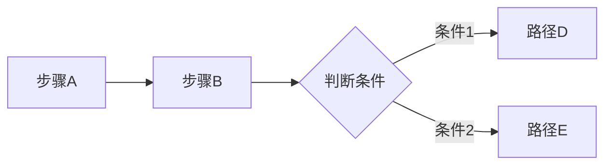

# Resume Tailor Diagram

## 目的

让用户补充描述自己做过的一个项目或工作流程，结合简历中的已有信息，生成 Mermaid 架构图或业务流程图。让 recruiter 一眼看懂候选人做过的事情的结构和复杂度。

核心原则：**简历里写了什么 + 用户补充了什么 = 图里画什么**。不凭空编造。

自动模式只使用 `candidate-profile.json` 中的经历标题和条目。无法证明节点关系
时生成证据图，不得把条目擅自解释成系统调用关系。

## 触发时机

- **管线内触发**：write 阶段完成后，问用户是否要为某个项目经历画架构图
- **独立触发**：用户随时说"帮我画个项目架构图"

## 项目细节输入（两种渠道都支持）

### 渠道 A — 用户提供 Markdown 文件

用户提供描述项目细节的 md 文件（如 `data/projects/xx项目.md`），包含：项目背景、做了什么、涉及的工具/平台/系统、流程步骤、上下游关系。

### 渠道 B — 用户在对话中直接描述

用户口述项目情况，我交互式追问补充细节。

两种渠道可以同时使用（文件 + 口头补充）。

## 输入

- `data/resume.md` 或定制后的 `resume.md`
- `data/experience-bank.md`（如有）
- 用户通过渠道 A 或 B 提供的项目细节描述（主要信息来源）
- `job.json` + `analysis.md`（管线内触发时有，独立触发时无）

## 输出

- 管线内：`output/<run_id>/jobs/<job_id>/diagrams.md`
- 独立触发：`output/diagrams/<项目名>.md`

每个项目生成 1 张 Mermaid 图和 1 份可面试使用的项目讲解稿。Mermaid 源码必须
保留在 fenced code block 中，方便用户复制；报告页面会在每张图右上角提供
“复制 Mermaid”按钮，复制原始源码而不是渲染后的 SVG；不得只输出渲染后的图片。

## 信息收集与充分性判断（核心）

### 充分信息标准

至少满足前 3 项才算信息充分：

| # | 需要知道 | 说明 |
|---|---------|------|
| 1 | 起点和终点 | 项目/流程从哪开始、到哪结束 |
| 2 | 关键步骤/环节/模块 | 至少拆出 3 个以上节点 |
| 3 | 各环节之间的关系 | 顺序流转 / 并行 / 判断分支 |
| 4 | 涉及的具体工具/系统/平台名 | 加分项，缺了可用泛指词 |
| 5 | 各环节的输入/输出 | 加分项，缺了可省略 |

### 追问策略

- 缺第 1 项 → 问起点终点
- 缺第 2 项 → 让用户一步步按顺序说
- 缺第 3 项 → 问是顺序还是并行，有没有判断分支
- 第 4、5 项缺失不阻塞生成，用泛指词代替；但缺少起点、终点、三步以上节点或关系时不得生成图。

追问最多 3 轮。3 轮后仍不足 → 如实告知 + 给出整理模板让用户回去填。

### 文科类工作特别处理

不要求"技术复杂度"。文科工作（运营、市场、行政、HR、销售、新媒体等）同样可以画图——把"做什么事"转换成流程节点。

| 例子 | 画成什么 |
|------|---------|
| 公众号内容策划与发布 | 内容生产流程：选题→撰稿→审核→排版→发布→复盘 |
| 统筹年会活动 | 活动流程：需求确认→场地筛选→供应商对接→物料准备→现场执行→收尾 |
| 招聘全流程 | 招聘流程：需求对接→JD发布→简历筛选→初面→复面→offer→入职 |
| 搭建数据报表体系 | 数据流程：多数据源→ETL清洗→数仓建模→BI看板→定时推送 |

判断标准不是"技术复杂度"，而是**"流程是否够具体"**。

## 经历深度不足时的主动引导

信息收集阶段，如果发现以下情况，主动向用户提议深挖：

- 描述只有 2-3 个模糊步骤，拆不出足够节点
- 简历只写了一句话，用户也补充不出细节
- 有明显可量化的成果空间但没提到任何数字
- 用户自己说"这个项目做得比较简单"

**提议话术**：

> "你目前的经历描述比较简略，画出来的图可能也比较单薄，不太能体现你的实际能力。要不要我帮你深挖一下这个项目？我可以引导你从不同角度重新梳理，可能会发现一些你之前没意识到的亮点。你确认之后，我会帮你同步美化简历对应段落和架构图。要不要试试？"

**用户同意后**，按以下维度逐个提问（每次只问一个）：

| 深挖角度 | 引导问题示例 |
|---------|------------|
| 规模感 | 影响了多少人/客户/数据量？大致量级就行 |
| 难点 | 遇到的最大困难？怎么解决的 |
| 协作 | 一个人做的还是跟团队？你负责哪个环节 |
| 前后对比 | 接手前什么状态？做了之后变成什么样 |
| 工具与方法 | 用了什么工具/平台？Excel/微信群/飞书文档都算 |
| 复用与影响 | 你的方法有没有被同事/部门沿用 |
| 决策权 | 哪些决定是你自己做的，哪些需要请示 |

**深挖原则**：

- 每次只问一个问题，根据回答决定下一步追问方向
- 用户答不上来就跳过，换个方向
- 用户说的每一句话如实记录，不替用户脑补
- 用户实在挖不出了就用现有信息画图，注明"基于目前已提供的信息生成"
- 用户确认过的新信息可写回定制简历对应段落 + 体现在架构图中

**包装与重构边界**：

✅ 可以做（经用户确认后）：
- 把用户新说出的细节补充到简历和架构图中
- 用更专业的措辞改写口语化描述
- 把零散信息组织成清晰的流程
- 帮用户识别他没意识到的亮点

❌ 不能做（即使有授权）：
- 放大数字（"几十个客户"不能写成"100+"）
- 添加用户没提过的工具/技能
- 替用户编时间线
- 用户说"真的想不出来了"时继续 push

## 图表类型选择

不区分文理科，只看内容特征：

| 内容特征 | Mermaid 类型 |
|---------|-------------|
| 多组件/系统/部门之间的关系 | `flowchart TD` |
| 有时间顺序的步骤流转 | `flowchart LR` |
| 不同角色/系统之间的消息传递 | `sequenceDiagram` |
| 用户操作体验路径 | `journey` |
| 有判断分支的决策流程 | `flowchart` + 菱形节点 |
| 多维度能力全景展示 | `mindmap` |

用户未指定类型时，我根据内容特征自动选择，并在生成前告知用户。

## 生成规则

**信息来源优先级**（按可靠程度排序）：
1. 用户本次确认过的深挖补充内容
2. 简历 `resume.md` 中的已有内容
3. 经验库 `experience-bank.md` 中的已有内容
4. 用户通过渠道 A（md 文件）提供的描述

- 每个节点必须有上述来源之一，不凭空发明
- 经用户确认的深挖内容写入节点时，视为用户提供的事实，无需额外标注
- 用户没写具体工具名就用泛指词（"消息队列"而非"Kafka"）
- 缺失的环节用虚线节点 + `(待确认)` 标注，图下方集中列出
- 如果项目描述只有一条线性步骤且没有模块、分支、输入输出或结果信息，优先生成 `mindmap` 全景图或停下来追问，不生成单纯 `A --> B --> C` 的串行图。
- Mermaid 代码块下方必须有“项目讲解稿”，按背景 → 关键环节 → 方法/工具 → 结果组织，不能新增输入中没有的事实。
- 节点文字 ≤20 字，语言与用户描述保持一致
- 图标题从项目名+核心内容自动生成
- 图下方标注证据来源组合
- 管线内触发时，JD 相关的节点用 `style` 高亮

## 输出格式

```markdown
# 架构与流程图：<项目名称>

> 以下图表基于你的简历和补充信息生成。
> ⚠️ 标记为「待确认」的虚线节点需要你核对。

---

## <图标题>

**类型**：<flowchart TD / flowchart LR / sequenceDiagram / journey / mindmap>
**证据来源**：<简历对应章节 · 项目名> + 用户补充描述



**待确认项**：
- <逐条列出虚线节点及原因，如无则写"无">
```
